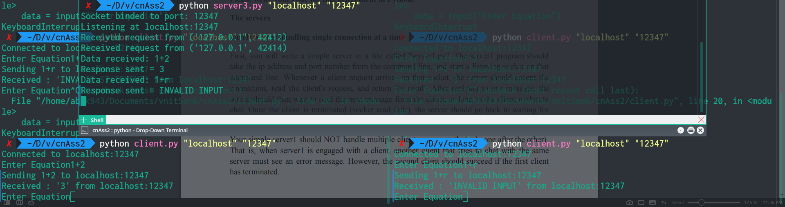

[![Contributors][contributors-shield]][contributors-url]
[![Forks][forks-shield]][forks-url]
[![Stargazers][stars-shield]][stars-url]
[![Issues][issues-shield]][issues-url]
[![MIT License][license-shield]][license-url]
[![LinkedIn][linkedin-shield]][linkedin-url]

<!-- PROJECT LOGO -->
<br />
<p align="center">
<!--   <a href="https://github.com/abhk943/socketCN">
    
  </a> -->

  <h1 align="center">Calculator server: Python Sockets</h1>

  <p align="center">
    Concurrent socket servers using multi-threading and select, which take in mathematical equation in string form and return the result. 
    <br />
    <br />
    <a href="#testing">View Demo</a>
    ·
    <a href="https://github.com/abhk943/socketCN/issues">Report Bug</a>
  </p>
</p>

<!-- TABLE OF CONTENTS -->
<details open="open">
  <summary><h2 style="display: inline-block">Table of Contents</h2></summary>
  <ol>
    <li>
      <a href="#about-the-project">About The Project</a>
      <ul>
        <li><a href="#built-with">Built With</a></li>
      </ul>
    </li>
    <li>
      <a href="#getting-started">Getting Started</a>
      <ul>
        <li><a href="#prerequisites">Prerequisites</a></li>
        <li><a href="#installation">Installation</a></li>
      </ul>
    </li>
    <li><a href="#usage">Usage</a></li>
    <li><a href="#working">Working</a></li>
    <li><a href="#testing">Testing</a></li>
    <li><a href="#roadmap">Roadmap</a></li>
    <li><a href="#contributing">Contributing</a></li>
    <li><a href="#license">License</a></li>
    <li><a href="#contact">Contact</a></li>
    <li><a href="#acknowledgements">Acknowledgements</a></li>
  </ol>
</details>

<!-- ABOUT THE PROJECT -->

## About The Project


The project implements 4 servers: simple, multi-threaded, select, these all calculate and a select echo server, along with a client to test the servers.
Sockets use TCP-IPv4.

After you connect to server as a client the connection will be live until the client terminates.

### Built With

- [Python](https://www.python.org)
- [Sockets](https://docs.python.org/3/library/socket.html)

<!-- GETTING STARTED -->

## Getting Started

To get a local copy up and running follow these simple steps.

### Prerequisites

Install following packages in your environment:

- pip
  ```sh
  pip install python
  ```

### Installation

1. Clone the repo:
   ```sh
   git clone https://github.com/abhk943/socketCN.git
   ```

<!-- USAGE EXAMPLES -->

## Usage

Run the below command in your command line terminal to launch the program:

```
python serverx.py 'host' 'port'
python client.py 'host' 'port'
```

<!-- WORKING -->

## Working


- server1.py: A single process server that can handle only one client at a time, refusing any second connection.
- server2.py: A multi-threaded server that creates a new thread for every new client request it receives. Multiple clients can be simultaneously connected with the server.
- server3.py: A single process server that uses select to handle multiple clients concurrently.
- server4.py: An echo server using select to handle multiple clients.
- client.py: After connection with server is established, client can send as many number of requests containing simple computations to the server.
<!-- TESTING -->

## Testing

Various test files were used to check:

- accuracy
- concurrency

<details>
  	<summary>Check all tests!</summary>

[server1.py](./server1.py)


- Refusing multiple connections:


[server2.py](./server2.py)


[server3.py](./server3.py)



[server4.py](./server4.py)


- Port occupied:


- Server timeout:


</details>

<!-- ROADMAP -->

## Roadmap

See the [open issues](https://github.com/abhk943/socketCN/issues) for a list of proposed features (and known issues).

<!-- CONTRIBUTING -->

## Contributing

Contributions are what make the open source community such an amazing place to be learn, inspire, and create. Any contributions you make are **greatly appreciated**.

1. Fork the Project
2. Create your Feature Branch (`git checkout -b feature/AmazingFeature`)
3. Commit your Changes (`git commit -m 'Add some AmazingFeature'`)
4. Push to the Branch (`git push origin feature/AmazingFeature`)
5. Open a Pull Request

<!-- LICENSE -->

## License

Distributed under the MIT License. See `LICENSE` for more information.

<!-- CONTACT -->

## Contact

Abhishek Kumar Yadav - [twitter/abhk943](https://twitter.com/abhk943) - abhk943@gmail.com

Project Link: [https://github.com/abhk943/socketCN](https://github.com/abhk943/socketCN)

<!-- ACKNOWLEDGEMENTS -->

## Acknowledgements

- [positronx/socket](https://www.positronx.io/create-socket-server-with-multiple-clients-in-python/)
- [steelkiwi/working-tcp-sockets](https://steelkiwi.com/blog/working-tcp-sockets/)
- [yasoob/python-socket-network](https://yasoob.me/2013/08/06/python-socket-network-programming/)
- [python/socket](https://docs.python.org/3/library/socket.html)
- [techbeamers/python-tutorial-write-multithreaded-python-server](https://www.techbeamers.com/python-tutorial-write-multithreaded-python-server/)
- [python/errors](https://docs.python.org/3/tutorial/errors.html)
- [python/multiprocessing](https://docs.python.org/3/library/multiprocessing.html)
- [realpython/python-sockets](https://realpython.com/python-sockets/#echo-client-and-server)

<!-- MARKDOWN LINKS & IMAGES -->
<!-- https://www.markdownguide.org/basic-syntax/#reference-style-links -->

[contributors-shield]: https://img.shields.io/github/contributors/abhk943/socketCN.svg?style=for-the-badge
[contributors-url]: https://github.com/abhk943/socketCN/graphs/contributors
[forks-shield]: https://img.shields.io/github/forks/abhk943/socketCN.svg?style=for-the-badge
[forks-url]: https://github.com/abhk943/socketCN/network/members
[stars-shield]: https://img.shields.io/github/stars/abhk943/socketCN.svg?style=for-the-badge
[stars-url]: https://github.com/abhk943/socketCN/stargazers
[issues-shield]: https://img.shields.io/github/issues/abhk943/socketCN.svg?style=for-the-badge
[issues-url]: https://github.com/abhk943/socketCN/issues
[license-shield]: https://img.shields.io/github/license/abhk943/socketCN.svg?style=for-the-badge
[license-url]: https://github.com/abhk943/socketCN/blob/master/LICENSE.txt
[linkedin-shield]: https://img.shields.io/badge/-LinkedIn-black.svg?style=for-the-badge&logo=linkedin&colorB=555
[linkedin-url]: https://linkedin.com/in/abhk943
